<meta name="google-site-verification" content="FscKtGNr9FhtKO7F6JX0py_fleDaenj827Abbb02SE8" />

<h1 align="center">Hi, I'm Ken a.k.a. Coding Ken. Welcome! 👋🏾</h1>

👨🏾‍💻 I'm a software developer. 

💼 I’m focused on enhancing my technical skills.  

📫 [Click here to e-mail me.](https://linktr.ee/TheDevCodingKen) 

👀 [Check out my developer portfolio.](https://www.CodingKen.dev/) 

⚡ Fun fact: I LOVE movies 🎬 especially action/adventure/sci-fi thrillers.

### Latest Verified Skills and Digital Certifications:
<!--START_SECTION:badges-->

<!--END_SECTION:badges-->

 ### Markup Languages, Programming Languages, Libraries, Frameworks & Tools:

Click to expand

 
 
 
 
 
 
 
 
 
 
 
 
 
 
 
 
 
 

 
 
 
 
 

### My GitHub Stats:

Click to expand

<h3 align="center">
 
  
  
  
</a>

### My 2025 Coding Stats:

### Connect with me:

 

