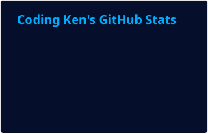

<meta name="google-site-verification" content="FscKtGNr9FhtKO7F6JX0py_fleDaenj827Abbb02SE8" />

<h1 align="center">Hi, I'm Ken a.k.a. Coding Ken. Welcome! 👋🏾</h1>

👨🏾‍💻 I'm a software developer. 

📫 [Click here to e-mail me.](https://linktr.ee/TheDevCodingKen) 

---

### 🚀 My Latest OSS Activity

<!--START_SECTION:activity-->
1. 🗣 Commented on [#3435](https://github.com/tektoncd/plumbing/issues/3435#issuecomment-5147184802) in [tektoncd/plumbing](https://github.com/tektoncd/plumbing)
2. 🗣 Commented on [#3805](https://github.com/tektoncd/operator/pull/3805#issuecomment-5144836776) in [tektoncd/operator](https://github.com/tektoncd/operator)
3. 🗣 Commented on [#3805](https://github.com/tektoncd/operator/pull/3805#issuecomment-5117064013) in [tektoncd/operator](https://github.com/tektoncd/operator)
4. 🗣 Commented on [#3805](https://github.com/tektoncd/operator/pull/3805#issuecomment-5093862879) in [tektoncd/operator](https://github.com/tektoncd/operator)
<!--END_SECTION:activity-->

---

### My GitHub Stats:

Click to expand

<h3 align="center">
 
  
  
  
</a>

### My 2025 Coding Stats:

---

### Connect with me:

 

